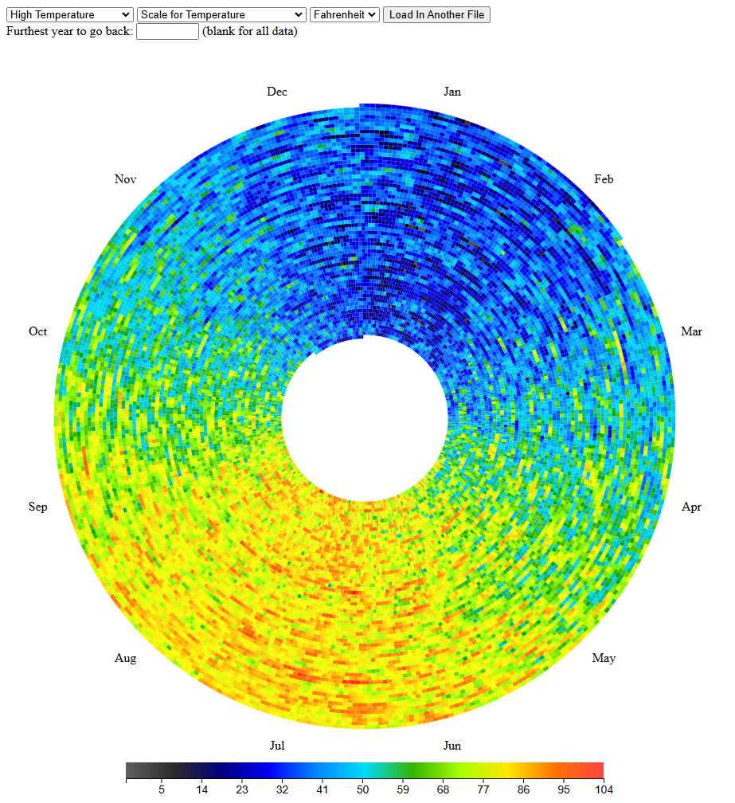

#########################################
Long Play - Weather Data Radial Heat Map
#########################################

Load in data from  `Metrostat <https://dev.meteostat.net/bulk>`_

#########
Updates
#########

**1/15/2025** - Temperature scale

**1/10/2025** - Added scales and more data types

**1/6/2025** - First alpha version, fixed a degree symbol bug

################
How to Use
################

Simply run the index file and load in a CSV file of `Metrostat weather data <https://dev.meteostat.net/bulk>`_

If you would like a working example you can visit the 
`website <https://longplay.brokenpen.net/>`_

Grand Rapids Michigan US data from 1963-2024  
  
###############
Other Notes
###############

This is not great code, I am more of an artist than a programmer. There are a lot of things I want to do with this but open sourcing it means you can do what you want with it as well.
